# 配置自适应项目新人导读

> 适用对象：第一次接触本项目、了解 Python 但不熟悉网络配置转换业务的开发者。
> 阅读目标：能够解释系统为什么存在、一次转换如何完成、代码职责如何划分，并能独立调试和完成常见扩展。

## 1. 先用一句话理解项目

本项目读取真实网络的 Excel 拓扑和 Cisco IOS XR / Juniper Junos 配置，把真实设备上的接口、聚合、UNI、认证等配置转换成可在 GNS3 的 XRv9000 / vMX 镜像中运行的一套拓扑与配置。

它不是通用的“任意厂商配置翻译器”，核心目标是解决下面这个具体问题：

- 真实设备与虚拟镜像的接口名称、接口数量不同。
- 真实设备可能用多条物理链路组成聚合口，而实验环境希望压缩物理资源。
- 大量用户侧接口需要汇聚到有限的模拟器端口。
- 生产认证、AAA、SNMP 等管理面配置不能直接带进实验环境。
- 转换必须可审计、可重复，并且失败时不能产出看似可用、实际不完整的配置。

## 2. 建立业务心智模型

### 2.1 系统边界

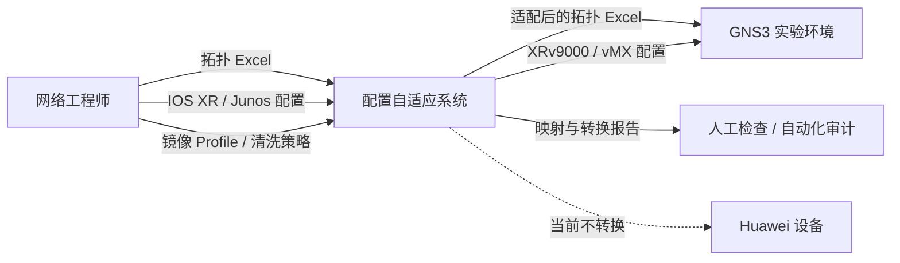

当前支持：

- Cisco IOS XR 配置到 GNS3 XRv9000。
- Juniper Junos 大括号配置到 GNS3 vMX。
- Cisco 与 Juniper 之间的跨厂商 NNI。
- 普通链路、聚合链路和同一聚合跨多个对端的 M-LAG 形态。

当前不负责：

- Huawei 配置转换。
- IOS、IOS XE、NX-OS 等其他 Cisco 操作系统的语法转换。
- 校验链路两端的 IP、VLAN、MTU、封装是否一致。
- 在 GNS3 中自动创建或启动节点。
- 为 UNI 创建真实的外部 GNS3 链路。

### 2.2 核心术语

| 术语 | 在本项目中的含义 | 如何识别 |
| --- | --- | --- |
| NNI | 网络设备之间的连接接口 | 以 Excel `链接表` 为权威来源 |
| UNI | 未出现在链接表中、但承载有效用户业务的接口 | NNI 处理后，从剩余业务接口中识别 |
| Loopback | 环回逻辑接口 | Cisco `Loopback*`，Junos `lo0.*`；原样保留 |
| 管理口 | 设备管理接口 | Cisco `MgmtEth*`，Junos `fxp*`、`em*` 等；不参与业务映射 |
| 聚合口 | 多个物理成员组成的逻辑接口 | Cisco `Bundle-Ether*`，Junos `ae*` |
| 聚合扁平化 | 用一个模拟器物理口承载原聚合逻辑配置 | NNI/UNI 处理阶段完成 |
| Group | 厂商配置中的继承/模板机制 | Cisco `group/apply-group`，Junos `groups/apply-groups` |
| Profile | 目标虚拟镜像提供的接口和适配策略 | `config/image_profiles.yaml` |
| Mapping | 一条源接口到目标接口的可审计记录 | 输出到 `interface-mapping.json` |

### 2.3 最重要的分类规则

链接表决定 NNI，UNI 是在排除 NNI 之后识别出的剩余有效业务接口：

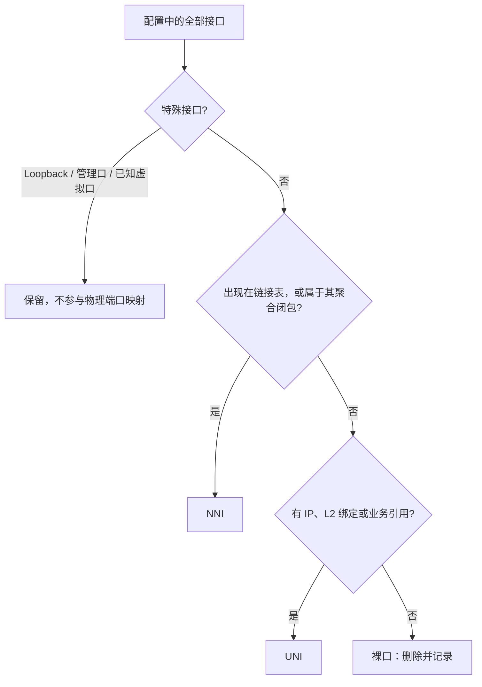

因此处理顺序必须是 `Group → NNI → UNI`：

1. Group 可能为接口继承地址、VLAN、聚合和认证配置，所以必须先展开。
2. Excel 常记录聚合的物理成员，而业务配置实际在 Bundle/ae 上，所以 NNI 必须先闭包分析。
3. UNI 是排除完整 NNI 集合之后的差集，不能提前处理。

## 3. 输入和输出

### 3.1 必需输入

一次转换至少需要：

```text
input/
├── topology.xlsx
└── configs/
    ├── R1.cfg
    ├── R2.cfg
    ├── J1.cfg
    └── J2.cfg
```

Excel 至少包含两个工作表：

| 工作表 | 必需字段 | 含义 |
| --- | --- | --- |
| 设备列表 | 设备名称、厂商 | 定义设备主键和解析器类型 |
| 设备列表 | 配置文件（可选） | 未填写时按设备名查找 `.cfg/.conf/.txt` |
| 链接表 | A端设备、A端接口、Z端设备、Z端接口 | 定义物理 NNI |

程序兼容常见中英文 Sheet 名和列名，实际别名定义在 `constants.py`。

设备名称是系统中的主键，必须非空且全局唯一。链接表只要某一列有值，就要求四个端点字段全部填写。

### 3.2 可选输入

| 文件 | CLI 参数 | 用途 |
| --- | --- | --- |
| 镜像 Profile | `--profiles` | 定义镜像、版本、可用接口和模拟参数策略 |
| 清洗策略 | `--washing-policy` | 定义 Group 未知语义策略和可选能力清洗开关 |
| 外部清洗规则 | `--rules` | 追加 `delete/replace/mask/warn` 规则 |

镜像接口列表有一个容易忽略的约定：

```text
interfaces[:-1]  = 按顺序分配给 NNI
interfaces[-1]   = 专门承载所有 UNI 子接口
```

例如默认 Cisco Profile 有 8 个接口，前 7 个可分配给 NNI，最后 1 个作为 UNI 父接口。

### 3.3 输出与失败语义

成功时：

```text
output/
├── topology-adapted.xlsx
├── configs/
│   └── <设备名>.cfg
├── interface-mapping.json
├── report.json
└── README.txt
```

失败时只写诊断文件：

```text
output/
├── interface-mapping.json
└── report.json
```

这是一个重要的安全边界：一旦存在错误，系统不会写出设备配置和适配后的拓扑，避免使用者误把“只转换了一半”的结果导入实验环境。

## 4. 一次完整转换发生了什么

### 4.1 总流程图

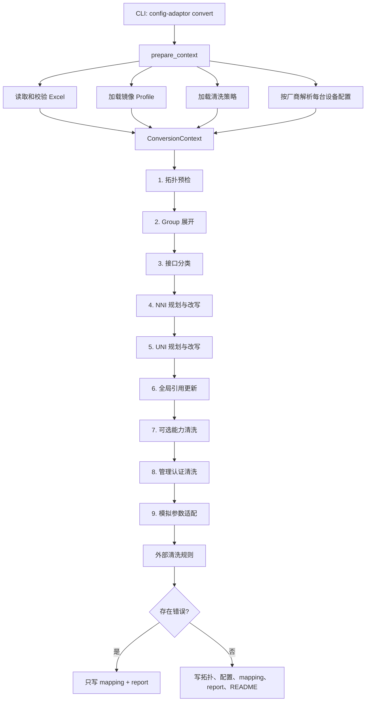

### 4.2 调用时序图

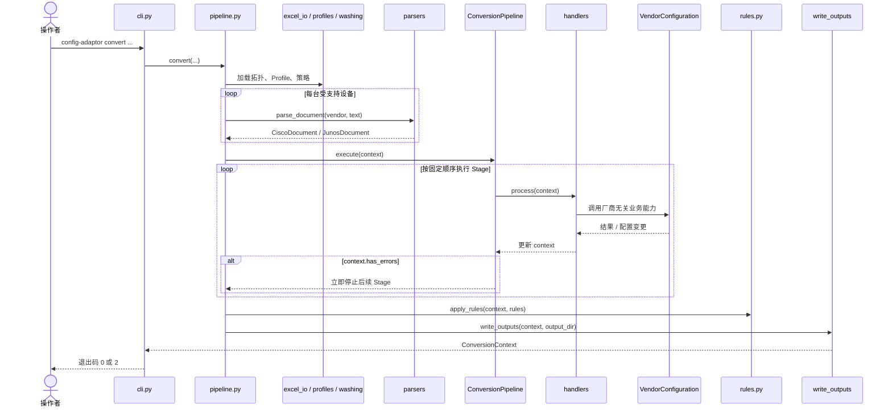

注意：只要输入准备阶段没有错误，核心 Pipeline 返回后就会执行外部清洗规则；即使某个 Stage 已报错并停止后续 Stage，规则阶段仍可能记录命中，但失败结果最终只输出诊断文件。`write_outputs()` 无论成功失败都会执行，以确保失败报告可用。

## 5. 代码架构

### 5.1 分层关系

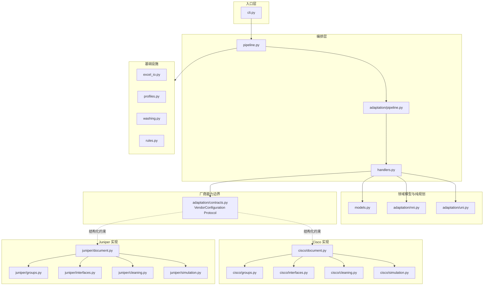

虚线表示 Python `Protocol` 的结构化实现关系：`CiscoDocument` 和 `JunosDocument` 不需要继承某个 Java 风格基类，只要实现约定的方法即可。

### 5.2 各目录的职责

| 路径 | 职责 | 新人是否应先读 |
| --- | --- | --- |
| `cli.py` | 参数解析、退出码 | 是 |
| `pipeline.py` | 准备上下文、执行流程、写输出 | 是 |
| `handlers.py` | 九个业务阶段 | 是，核心 |
| `models.py` | 设备、链路、映射、Profile、上下文 | 是 |
| `adaptation/pipeline.py` | Stage 协议和停止规则 | 是 |
| `adaptation/nni.py` | 聚合链路分组的纯计算 | NNI 业务时读 |
| `adaptation/uni.py` | UNI VLAN 唯一分配 | UNI 业务时读 |
| `adaptation/contracts.py` | 应用层可以依赖的厂商能力 | 是，理解边界 |
| `cisco/document.py、juniper/document.py` | AST、解析、渲染及兼容 Facade | 第二阶段读 |
| `cisco/groups.py、juniper/groups.py` | 厂商 Group 事务式展开 | 专项阅读 |
| `cisco/interfaces.py、juniper/interfaces.py` | 业务接口分析和配置树修改 | 专项阅读 |
| `cisco/cleaning.py、juniper/cleaning.py` | 强制及可选清洗 | 专项阅读 |
| `cisco/simulation.py、juniper/simulation.py` | 镜像运行参数适配 | 专项阅读 |
| `excel_io.py` | Excel 读写和列别名处理 | 输入问题时读 |
| `profiles.py` / `washing.py` | YAML 配置加载与校验 | 策略问题时读 |
| `rules.py` | 外部清洗规则 | 自定义清洗时读 |

### 5.3 为什么有些东西是类，有些是函数

当前设计遵循“有持续状态或明确对象身份时使用类，无状态计算使用函数”：

- `ConversionPipeline` 是类：它持有固定顺序的 Stage 集合。
- `CiscoGroupExpander` / `JunosGroupExpander` 是类：递归展开期间需要维护事务副本、继承栈、优先级和冲突状态。
- `CiscoDocument` / `JunosDocument` 是类：它们持有并修改一份配置 AST。
- `ConversionContext` 等是 dataclass：它们表达一次转换过程中的领域数据。
- `plan_nni_components()` 是函数：输入链路和聚合关系，输出不可变计划，不持有状态。
- `allocate_uni_vlans()` 是函数：输入接口集合，稳定地产生 VLAN 分配。
- `cisco/interfaces.py、juniper/interfaces.py`、`cleaning.py`、`simulation.py` 使用模块函数：这些操作依赖传入的 Document，但自身不需要额外对象生命周期。

## 6. 贯穿流程的核心数据

### 6.1 数据关系图

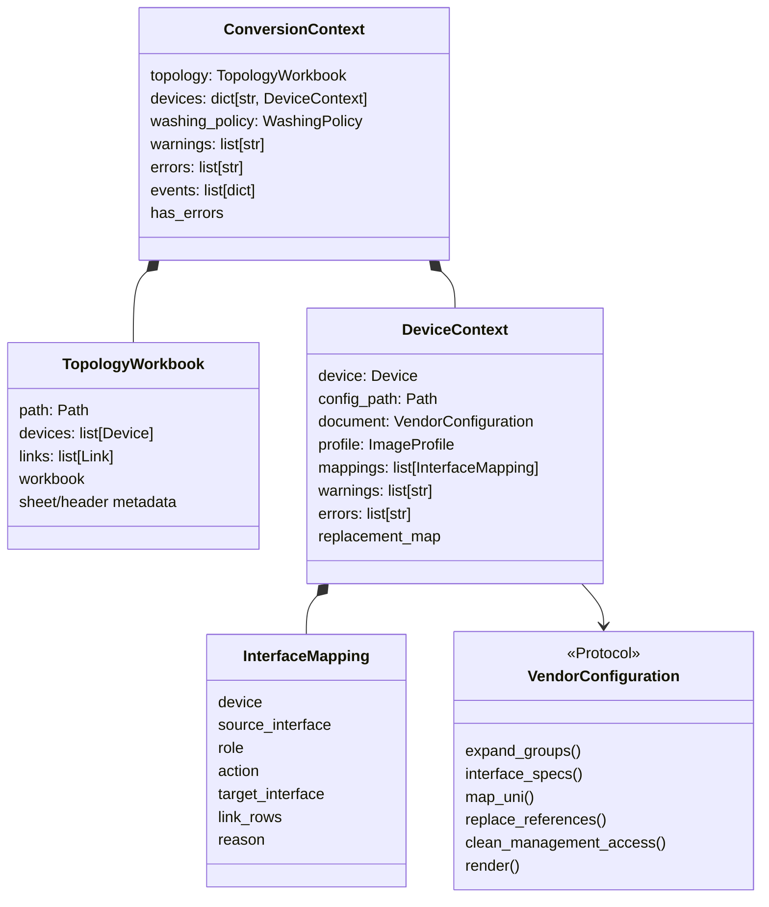

### 6.2 `ConversionContext` 是流程总账

每个 Stage 接收同一个 `ConversionContext`，主要修改四类内容：

1. `topology.links`：目标接口名、链路是否有效、被删除原因。
2. `device.document`：设备配置 AST。
3. `device.mappings`：每一次接口迁移、删除、扁平化或跳过。
4. `errors/warnings/events`：面向用户和审计系统的诊断信息。

不要在 Stage 之间增加隐藏的全局变量。需要跨阶段传递的数据，应进入 Context、DeviceContext 或一个明确的计划对象。

### 6.3 `InterfaceMapping` 不只是改名字典

映射支持一对多和删除语义。例如 M-LAG 中一个 Bundle 可能被复制到两个目标口：

```json
[
  {
    "device": "R1",
    "source_interface": "Bundle-Ether10",
    "role": "NNI",
    "action": "clone-flatten",
    "target_interface": "GigabitEthernet0/0/0/0",
    "link_rows": [2],
    "reason": "M-LAG 按对端拆分"
  },
  {
    "device": "R1",
    "source_interface": "Bundle-Ether10",
    "role": "NNI",
    "action": "clone-flatten",
    "target_interface": "GigabitEthernet0/0/0/1",
    "link_rows": [3],
    "reason": "M-LAG 按对端拆分"
  }
]
```

`DeviceContext.replacement_map` 会把这些记录聚合成：

```python
{"Bundle-Ether10": ["GigabitEthernet0/0/0/0", "GigabitEthernet0/0/0/1"]}
```

随后 `ReferenceRewriteHandler` 用它更新路由协议、L2VPN、策略等非接口定义中的引用。

## 7. 九个核心 Stage

| 顺序 | Stage | 输入关注点 | 主要副作用 | 关键失败条件 |
| --- | --- | --- | --- | --- |
| 1 | `TopologyPreflightHandler` | 拓扑设备和链路端点 | 标记跳过链路，保留 NNI 角色 | 端点设备不存在 |
| 2 | `GroupExpansionHandler` | 活动 Group 引用、已知接口 | 事务式展开 Group，记录冲突 | 引用缺失、循环或无法静态求值 |
| 3 | `InterfaceClassificationHandler` | 厂商接口类型 | 未知接口告警并保留 | 本阶段一般不失败 |
| 4 | `NNIHandler` | 活跃链路、聚合成员 | 分组、扁平化、M-LAG 拆分、端口分配 | 类型错误、成员歧义、端口不足 |
| 5 | `UNIHandler` | 剩余业务接口 | 删除裸口、QinQ 迁移、VLAN 分配 | VLAN 空间耗尽 |
| 6 | `ReferenceRewriteHandler` | 完整接口映射 | 更新全局接口引用 | 由厂商实现保证安全 |
| 7 | `OptionalFeatureWashingHandler` | 显式开关 | 清理协议认证、PKI、硬件、NAT、流量统计 | 策略文件先期校验 |
| 8 | `AuthWashingHandler` | 管理面配置 | 删除旧认证并增加实验账号 | 与清洗和写入视为同一阶段 |
| 9 | `SimulationAdaptationHandler` | Profile 与已映射数据口 | 启用接口、去硬件参数、提高过低 BFD 值 | 非法 Profile 先期校验 |

`ConversionPipeline` 每执行完一个 Stage 就检查 `context.has_errors`。一旦为真，后续 Stage 不再运行。

## 8. Group 展开

### 8.1 为什么 Group 很早处理

下面这类信息都可能只存在于 Group 中：

- 接口地址和 VLAN。
- Bundle/ae 成员关系。
- 协议中的接口引用。
- 用户、AAA 和管理服务。
- 可选清洗所关注的配置。

如果不先展开，后续接口分类与清洗看到的是不完整配置。

### 8.2 统一全量处理

系统展开并校验所有活动的 Group 引用及其完整依赖，不再提供按相关性筛选或
原样保留模式。未被活动配置引用的模板不会参与求值；活动引用存在缺失、循环、
运行时变量或其他无法安全静态解释的语义时，本次转换整体回滚。
Junos 的所有 `inactive:` 节点及其完整子树都会直接删除。
多个顶层 `groups {}` 会先规范化成一个容器，同名 Group 的配置片段按出现顺序合并。

### 8.3 统一优先级

两个厂商都遵守：

```text
显式配置
  > 更内层应用的 Group
  > 更外层应用的 Group
  > 同一 Group 列表中更靠前的 Group
```

冲突不是按“命令第一个单词”粗略判断，而是按完整层级和语义键判断。例如 `ipv4 address` 与 `ipv4 access-group` 不是同一个键；多个可重复的地址也不能互相覆盖。

### 8.4 事务语义

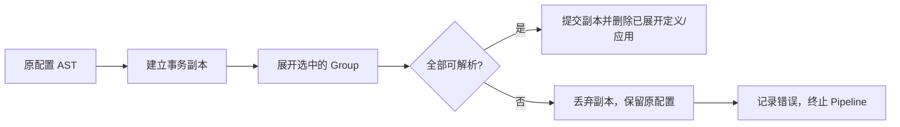

Cisco 和 Junos 的语法、通配符和递归机制不同，因此 Group 算法分别位于两个厂商目录，而事务和优先级原则保持一致。

## 9. NNI：物理链路与聚合扁平化

### 9.1 普通 NNI

普通链路按照 Excel 原始行号稳定排序。对链路两端分别使用本端 Profile 分配接口，因此跨厂商链路无需同名：

```text
Excel 源端：R1 Gi0/0/0/5  <->  J1 xe-1/2/0
目标 Cisco：GigabitEthernet0/0/0/0
目标 Junos： ge-0/0/0
```

系统保证“相同输入产生相同分配”，不会依赖字典的偶然顺序。

### 9.2 同一对端的聚合扁平化

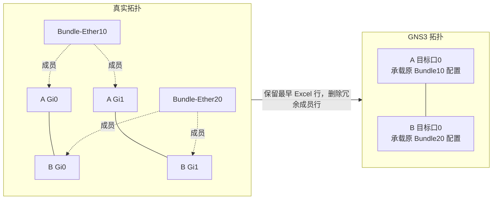

`plan_nni_components()` 只负责计算：

- 哪些 Excel 行属于同一个聚合组件。
- 每个组件保留哪一行。
- 哪些行是冗余行。
- 成员关系是否存在歧义。

这个函数不修改 Link 或 AST。只有计划无错误后，`NNIHandler` 才应用计划。

### 9.3 M-LAG 按对端拆分

同一个 Bundle/ae 的成员若连接到不同对端，不能合并成一条链路：

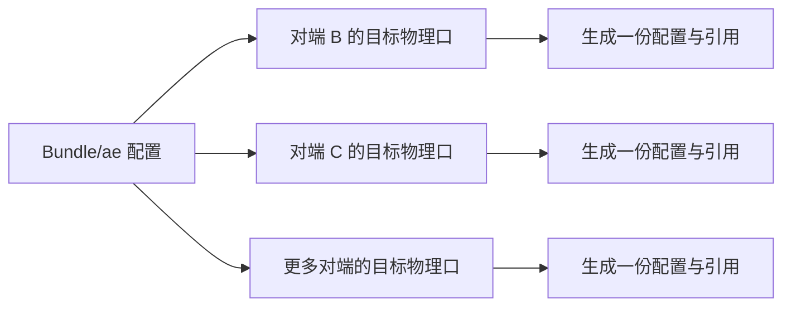

实现使用占位接口完成两阶段改名：

```text
源 Bundle/ae
  → ADAPT-NNI-0 / ADAPT-NNI-1（克隆）
  → 删除原聚合与成员
  → 最终目标物理口
```

这样可以避免目标名与源名重叠，以及第一个目标处理后丢失后续克隆源。

## 10. UNI：业务闭包、QinQ 与 VLAN 分配

### 10.1 什么是有效 UNI

一个接口不是因为“存在配置块”就自动成为 UNI。它至少应满足一种业务证据：

- 配置 IP 地址。
- 承载 L2VC/L2Circuit、L2 transport、CCC 或 bridge。
- 被 L2VPN、bridge-domain、VLAN、routing-instance 或路由协议引用。

只有 description、MTU 等非业务属性的接口是裸口，会删除并写入 `remove-bare` 映射。

### 10.2 网关接口为什么需要业务闭包

Cisco BVI 或 Junos IRB 即使有 IP，也不一定仍有用户业务。系统会沿广播域关系确认它是否与活跃 UNI 关联：

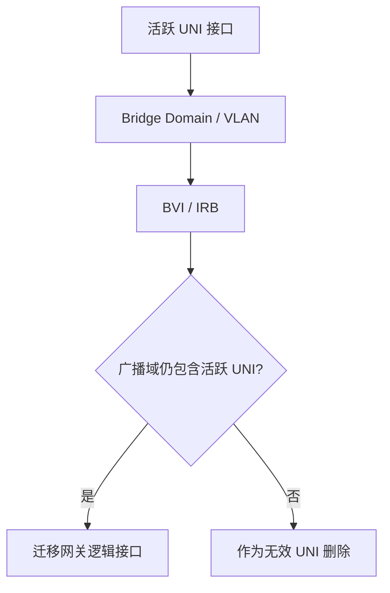

对 Cisco 而言，`BVI300` 中的 `300` 只是接口编号，不自动等于 VLAN 300。
系统只从同一 bridge-domain 的显式 attachment circuit 推导业务 VLAN；关系缺失
或标签不唯一时不猜测，由目标运输 VLAN 分配器选择空闲值。

### 10.3 VLAN 分配算法

VLAN 分配范围是 `2..4094`，并在每台设备内保证唯一：

1. 按稳定顺序遍历 UNI。
2. 原 VLAN 合法且尚未使用时保留。
3. 原 VLAN 缺失、非法或重复时，从 2 开始选择最小空闲值。
4. 目标子接口/unit 编号等于外层 VLAN。

```text
源 UNI-A，VLAN 100 → 目标 .100，外层 100
源 UNI-B，VLAN 100 → 目标 .2，  外层 2
源 UNI-C，无 VLAN  → 目标 .3，  外层 3
```

`allocate_uni_vlans()` 是纯函数，可以不构造完整配置文档就独立测试。

### 10.4 QinQ 改写

所有有效 UNI 汇聚到 Profile 的最后一个物理接口：

```text
多个源物理口 / Bundle / ae
          ↓
目标 UNI 父接口的多个子接口或 unit
          ↓
outer VLAN = 设备内唯一的目标编号
inner VLAN = 优先保留可识别的原业务 VLAN
```

迁移时会清除旧标签匹配、VLAN rewrite、接口模式等配置，再写入厂商对应的 QinQ 表达；`vlan-ccc` 等代表业务类型的语义会保留。

## 11. 厂商实现如何隔离

### 11.1 应用层只依赖业务能力

`handlers.py` 不应该知道 `CiscoNode` 或 `JunosNode`。它只通过 `VendorConfiguration` 调用：

- `expand_groups()`
- `interface_specs()` / `business_interface_names()`
- `clone_interface_tree()` / `rename_interface_tree()`
- `map_uni()`
- `replace_references()`
- `clean_management_access()`
- `adapt_to_simulation()`
- `render()`

这使相同的 NNI/UNI 流程可以同时调度 Cisco 与 Juniper，而厂商语法差异留在各自实现中。

### 11.2 Cisco 文档模型

IOS XR 配置由缩进和 `!` 边界构成树：

```text
interface GigabitEthernet0/0/0/0
 description TO-R2
 ipv4 address 10.0.0.1 255.255.255.252
!
```

主要对象是 `CiscoNode`。`CiscoDocument.root` 是不参与渲染的虚拟根，顶层命令和任意深度的子命令都使用同一节点类型。`CiscoDocument` 负责解析、保存节点顺序、提供 Facade 方法和最终渲染；接口、Group、清洗、模拟适配的具体算法放在 `cisco/`。

### 11.3 Junos 文档模型

Junos 配置天然是大括号树：

```text
interfaces {
    ge-0/0/0 {
        unit 0 {
            family inet {
                address 10.0.0.1/30;
            }
        }
    }
}
```

主要对象是 `JunosNode`。`JunosDocument` 管理整棵树并提供相同的 Facade 能力，具体算法位于 `juniper/`。

### 11.4 新增厂商时应遵循的边界

新增厂商通常需要：

1. 在 `Vendor` 中增加厂商枚举及别名。
2. 增加配置 Document、AST、解析和渲染。
3. 实现 `VendorConfiguration` 的全部能力。
4. 增加 Profile 默认值及 YAML 支持。
5. 在 `parse_document()` 中注册解析器。
6. 增加独立 fixture 与端到端测试。

不要在 `NNIHandler` 或 `UNIHandler` 中加入大量 `if vendor == ...`。如果差异属于语法或配置树操作，应下沉到厂商模块；只有真正跨厂商的业务策略才留在应用层。

## 12. 清洗与模拟适配

### 12.1 强制管理面清洗

系统始终删除生产环境中的：

- 本地账号。
- AAA、TACACS+、RADIUS。
- SSH/Telnet 网络管理服务与 SSH 信任。
- SNMP。
- 厂商相关的用户组、权限组和旧认证引用。

随后写入固定实验账号。账号只应用于隔离的 GNS3 实验环境，报告不得回显被删除的秘密值。

### 12.2 可选能力清洗

以下清洗默认关闭，只有策略文件显式设为 `true` 才执行：

- `protocol_authentication`
- `pki`
- `hardware`
- `nat`
- `flow_statistics`

默认保留未知配置是本项目的重要保守原则：不能确认不兼容时，不做大范围删除。

### 12.3 外部规则

外部规则在核心转换之后运行，支持：

| 动作 | 语义 |
| --- | --- |
| `delete` | 删除匹配配置 |
| `replace` | 替换匹配值 |
| `mask` | 清除秘密值但保留结构 |
| `warn` | 不修改，只记录命中 |

把外部规则放到核心接口分类之后，是为了防止自定义规则意外删除分类依据，改变 NNI/UNI 的核心语义。

### 12.4 模拟参数模式

| 模式 | 行为 |
| --- | --- |
| `off` | 不做模拟参数适配 |
| `compatible` | 启用已映射数据口，删除目标口不适用于镜像的物理硬件参数 |
| `stable` | 在 `compatible` 基础上，提高配置中已经存在且过低的 BFD 参数 |

系统不会凭空开启 BFD，也不会默认改写 OSPF、IS-IS 或 BGP 的业务定时器；只处理本次映射涉及的数据口。

## 13. 报告、告警与错误

### 13.1 三种诊断层次

| 类型 | 含义 | 是否阻断 |
| --- | --- | --- |
| `event` | 正常转换事实，如扁平化、Group 冲突、认证清洗 | 否 |
| `warning` | 保守保留或跳过，结果仍可用 | 否 |
| `error` | 无法保证结果完整正确 | 是 |

典型 Warning：

- 未识别的接口类型被原样保留，不参与物理映射。
- Huawei 设备及相关链路被跳过。

典型 Error：

- Excel 缺少必需 Sheet 或列。
- 链路端点设备不存在。
- 非物理/聚合接口被用作 NNI 端点。
- NNI 目标物理接口不足。
- 聚合成员关系存在歧义。
- Group 无法安全展开。
- UNI VLAN 空间耗尽。
- 配置语法无法安全解析。

### 13.2 `report.json` 阅读顺序

建议按以下顺序排查：

1. `status`：确认整体成功或失败。
2. `errors`：找第一个业务阻断原因。
3. `warnings`：确认有哪些内容被保留或跳过。
4. `summary`：核对设备、链路、映射和适配数量。
5. `events`：还原处理细节。
6. `group_conflicts`：专项检查继承覆盖。

`events` 是按处理时间追加的，因此也可以视为一次轻量级审计时间线。

## 14. 如何运行项目

### 14.1 环境

- Python 3.11 或更高版本。
- 运行依赖只有 `openpyxl` 和 `PyYAML`。

推荐安装开发版本：

```bash
python3 -m pip install -e .
```

### 14.2 执行转换

```bash
config-adaptor convert \
  --topology topology.xlsx \
  --config-dir configs \
  --output-dir output \
  --profiles config/image_profiles.yaml \
  --washing-policy config/washing_policy.example.yaml \
  --rules config/cleaning_rules.example.yaml
```

也可不安装直接执行：

```bash
PYTHONPATH=src python3 -m config_adaptor convert \
  --topology topology.xlsx \
  --config-dir configs \
  --output-dir output
```

退出码：

- `0`：成功。
- `2`：参数、加载、转换或输出失败。

### 14.3 运行测试

```bash
PYTHONPATH=src python3 -m unittest discover -s tests -v
```

测试分为两类：

- `tests/test_architecture.py`：纯规划器、Pipeline 停止行为、厂商协议边界。
- `tests/test_conversion.py`：真实 cfg/xlsx fixture 驱动的端到端业务场景。

## 15. 新人调试指南

### 15.1 从一次失败开始定位

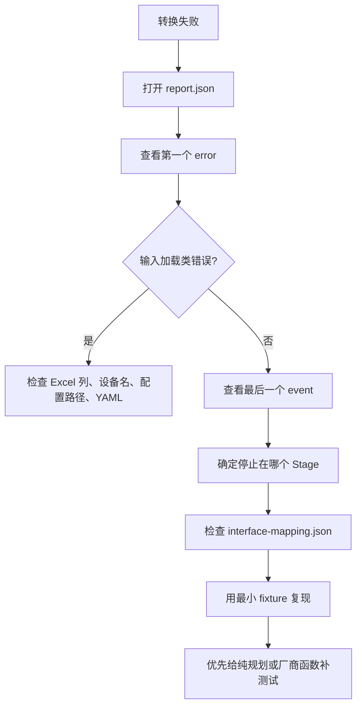

### 15.2 常见现象与入口

| 现象 | 优先查看 |
| --- | --- |
| 找不到 Sheet/列 | `excel_io.py`、`constants.py` |
| 配置文件找不到或路径被拒绝 | `pipeline._safe_config_path()` |
| Group 继承结果不对 | `<厂商>/groups.py` 和 `group_conflicts` |
| 接口被当成未知类型 | 对应解析器的 `interface_kind` |
| 聚合链路被错误合并 | `adaptation/nni.py` |
| M-LAG 少了一个目标 | `NNIHandler` 的 `plans_by_logical` 和 mappings |
| UNI 被删除 | `business_interface_names()` 与 `remove-bare` mapping |
| UNI VLAN 与预期不同 | `adaptation/uni.py` |
| 协议仍引用旧接口 | `replacement_map` 和 `replace_references()` |
| 某配置被意外删除 | mandatory/optional cleaning 事件与外部 rule 事件 |
| BFD 值发生变化 | Profile 的 `simulation_adaptation` 与对应事件 |

### 15.3 推荐的调试观察点

一次接口问题通常按下面的状态变化排查：

```text
原始配置接口名
  → resolve_interface() 后的规范名
  → interface_specs() 中的 kind/parent/unit/vlan
  → NNI component plan 或 UNI vlan plan
  → InterfaceMapping
  → replacement_map
  → render() 后的最终配置
```

不要只比较最终文本。Mapping 和 Event 能更快说明“系统为什么做出这个决定”。

## 16. 常见开发任务应该改哪里

### 16.1 增加一种接口名缩写

1. 修改对应解析器的 canonical 函数。
2. 增加解析器级测试或端到端 fixture。
3. 验证 Excel 缩写和配置完整名能解析到同一个父接口。

### 16.2 增加一种业务接口识别依据

1. 修改 `<厂商>/interfaces.py` 的业务闭包分析。
2. 确认它是否会激活 BVI/IRB 网关。
3. 同时添加“应迁移”和“不应迁移”的测试，避免把所有有 IP 网关都误判为活跃。

### 16.3 调整 VLAN 分配策略

1. 优先修改纯函数 `allocate_uni_vlans()`。
2. 用小型单元测试覆盖边界和确定性。
3. 再用 Cisco、Junos 各一个端到端测试确认语法落地。

### 16.4 增加一个 Pipeline 阶段

1. 判断它应位于接口改写前还是后。
2. 实现只带 `process(context)` 的 Stage。
3. 在 `build_default_pipeline()` 中显式插入。
4. 测试阶段顺序和出错停止行为。
5. 如果存在厂商差异，把语法操作加入 `VendorConfiguration`，实现放到厂商模块。

### 16.5 增加清洗项

- 所有环境都必须清理的管理面内容：修改厂商 `clean_management_access()`。
- 会改变业务能力、需要用户确认的内容：增加到 `WashingPolicy` 和 `clean_optional_features()`。
- 项目外部、镜像版本相关的个别规则：优先使用外部 YAML rule。

## 17. 测试策略

### 17.1 测试金字塔

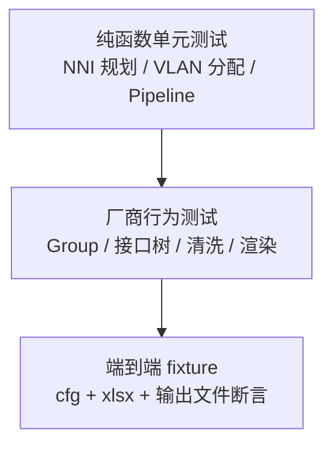

优先把跨厂商的业务计算写成纯函数，快速覆盖边界；厂商 AST 修改用厂商测试；最后用端到端测试保证所有环节能组合工作。

### 17.2 Fixture 命名所代表的业务

| 目录 | 主要覆盖 |
| --- | --- |
| `iosxr_bundle` | Cisco 聚合 NNI、UNI、认证清洗 |
| `junos_bundle` | Junos 聚合 NNI、UNI、认证清洗 |
| `iosxr_duplicate_vlan` | UNI VLAN 冲突重分配 |
| `iosxr_mlag` | Cisco 聚合跨对端拆分、QinQ、一对多引用 |
| `junos_mlag` | Junos ae 跨对端拆分、裸口与 QinQ |
| `cross_vendor` | Cisco/Juniper 普通及聚合互联 |
| `junos_unresolved` | Group 无法解析时回滚和失败输出 |
| `group_configs` | Group 优先级、通配、循环和冲突 |
| `washing_configs` | 强制与可选清洗 |
| `simulation_adaptation` | 镜像适配范围和幂等性 |

### 17.3 修改代码后的最低检查

```bash
PYTHONPATH=src python3 -m compileall -q src tests
PYTHONPATH=src python3 -m unittest discover -s tests -v
git diff --check
```

涉及输出语法时，还应人工检查至少一个对应厂商的最终 cfg、`interface-mapping.json` 和 `report.json`。

## 18. 设计原则与代码评审检查表

### 18.1 高内聚、低耦合在本项目中的具体含义

- 业务阶段关心“做什么”，厂商模块关心“用什么语法做”。
- AST 类型不泄漏到 `handlers.py`。
- NNI 分组和 VLAN 分配不依赖 Cisco/Junos 文本结构。
- 一个 Stage 只处理一个明确的业务阶段。
- 所有可审计副作用都进入 mapping、event、warning 或 error。
- 新厂商通过实现能力协议扩展，不修改每一个现有业务阶段。

### 18.2 避免过度拆分

新增文件或类之前先问：

1. 它是否有独立业务概念或变化原因？
2. 它是否能形成清晰、稳定的输入输出边界？
3. 它是否需要持有跨多个操作的状态？
4. 拆出后是否能独立测试或复用？

如果答案都是否，优先保留为现有模块中的私有函数。不要为单个无状态动作创建 `SomethingService`。

### 18.3 评审一个转换改动

- 是否保持相同输入产生相同输出？
- 是否在修改 AST 之前完成必要校验和规划？
- 是否考虑普通接口、子接口、聚合和 M-LAG？
- 是否同时更新非接口定义中的引用？
- 是否记录 mapping/event？
- 是否会在报告中泄露密码或密钥？
- 失败时是否会停止后续阶段并阻止配置输出？
- Cisco 与 Juniper 的差异是否放在厂商边界内？
- 是否有正向、冲突和失败测试？

## 19. 推荐阅读顺序

如果只有 30 分钟：

1. 本文第 1～4 节，建立业务和总流程。
2. `models.py`，认识 Context、Link、Mapping 和 Profile。
3. `pipeline.py` 的 `convert()`。
4. `handlers.py` 的 `build_default_pipeline()` 和九个 Stage 类名。
5. 选一个 `tests/test_conversion.py` 的端到端用例，从输入断言看到输出。

如果有半天：

1. 按上面的 30 分钟路径阅读。
2. 详细阅读 `NNIHandler`、`UNIHandler`。
3. 阅读 `adaptation/nni.py` 和 `adaptation/uni.py`。
4. 只选择自己更熟悉的一个厂商，阅读其 parser 和 `<厂商>/interfaces.py`。
5. 本地运行一个 fixture，并对照输出 mapping/report。

如果准备开始开发：

1. 阅读 `adaptation/contracts.py`，明确应用层边界。
2. 阅读相关业务 fixture 和已有断言。
3. 阅读目标厂商的 Group、接口、清洗或模拟适配模块。
4. 先补失败测试，再做最小实现。
5. 跑全量测试，并人工审查最终配置与报告。

## 20. 一条建议的代码跟踪路线

以命令行转换为例，从以下符号依次跳转，能够完整走通主干：

```text
config_adaptor.adaptation.cli.main
  → config_adaptor.adaptation.service.convert
  → config_adaptor.adaptation.service.prepare_context
  → config_adaptor.adaptation.topology.load_topology
  → config_adaptor.adaptation.factory.parse_document
  → config_adaptor.adaptation.pipeline.build_default_pipeline
  → ConversionPipeline.execute
  → 各 Handler.process
  → VendorConfiguration 的厂商实现
  → config_adaptor.adaptation.cleaning_rules.apply_rules
  → config_adaptor.adaptation.service.write_outputs
```

在 IDE 中建议先沿这条主干走一遍，再深入 Group 或 AST。直接从 500 行左右的厂商算法开始读，容易知道“怎么实现”，却不知道“为什么此时调用”。

## 21. 常见问题

### 为什么不直接做字符串替换？

因为接口映射可能一对多，配置具有层级，聚合需要克隆和删除，Group 有继承优先级。简单字符串替换会误改描述、丢失上下文，也无法安全处理 M-LAG。

### 为什么不先把所有配置统一成一个巨大通用 AST？

Cisco 块结构和 Junos 树结构差异很大。当前设计只统一应用层真正需要的能力和 `InterfaceSpec` 等小型数据结构，避免为了表面统一而丢失厂商语义。

### 为什么未知接口保留，而不是删除？

删除未知配置的风险高于保留。只要它没有被当作 NNI 物理端点，系统会告警并原样保留；若它被用作必须映射的 NNI，则因为无法保证正确性而失败。

### 为什么外部规则在核心转换之后？

核心分类需要完整的原始业务依据。先运行外部删除规则，可能让一个有效接口失去 IP、VLAN 或引用，从而改变 NNI/UNI 决策。

### 为什么失败还会创建输出目录？

为了写出 `report.json` 和已有的 `interface-mapping.json`，帮助定位失败；设备配置和适配拓扑不会生成。

### 为什么认证替换是强制的？

生产账号、AAA 和网络管理服务既可能在实验镜像中不可用，也涉及秘密信息和安全风险。项目统一替换为隔离实验账号，并确保报告不回显原秘密。

## 22. 相关文档

- `README.md`：安装、运行、输入输出和能力概览。
- `docs/requirements.md`：需求与验收基线。
- `docs/processing-flow.md`：Cisco/Junos 配置改写的详细规则。
- `config/image_profiles.yaml`：镜像 Profile 示例。
- `config/washing_policy.example.yaml`：Group 与可选清洗策略示例。
- `config/cleaning_rules.example.yaml`：外部规则示例。

建议把本文作为第一入口，把 `requirements.md` 当作“系统必须满足什么”，把 `processing-flow.md` 当作“具体语法如何改写”。
