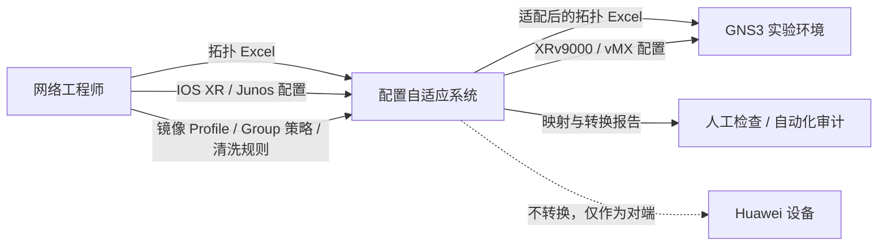
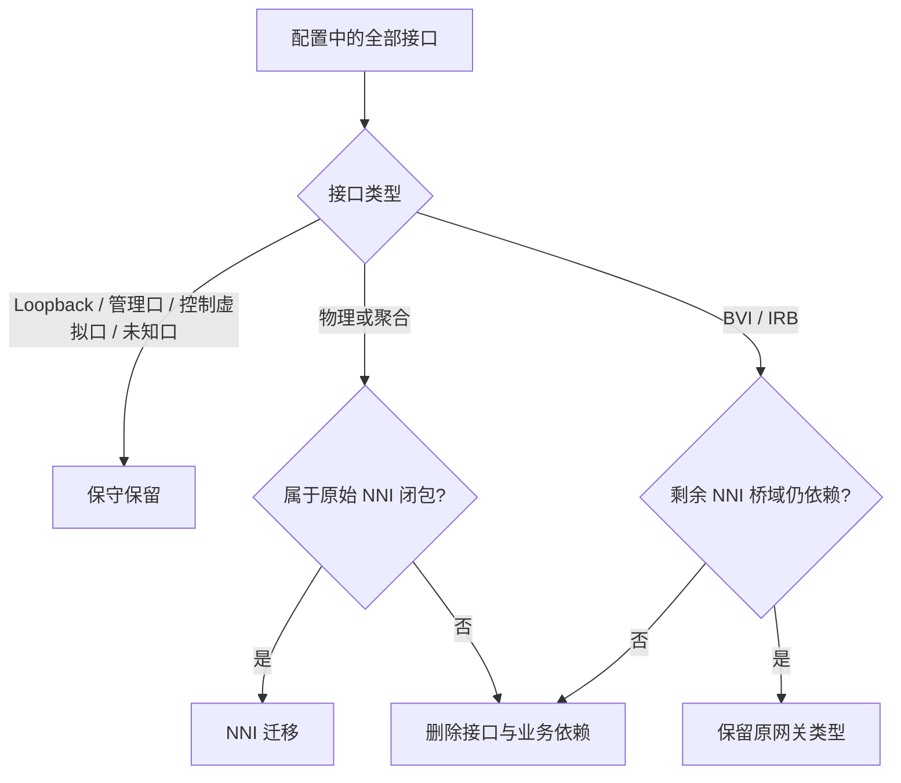
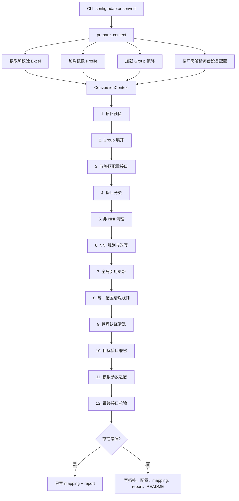
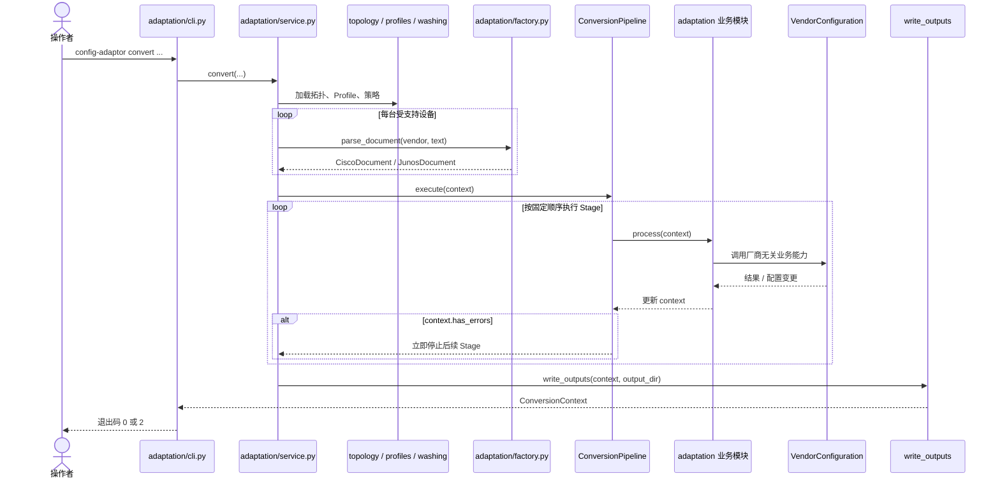
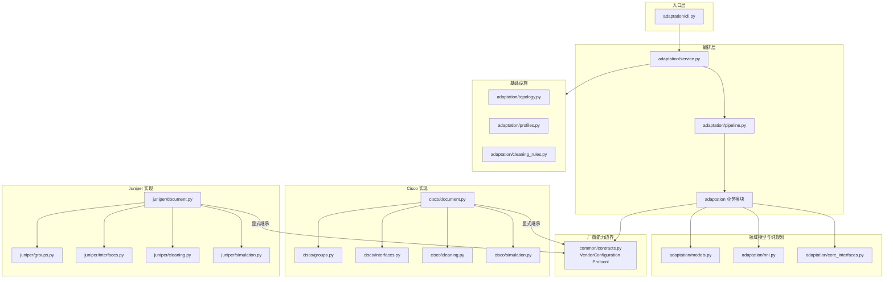
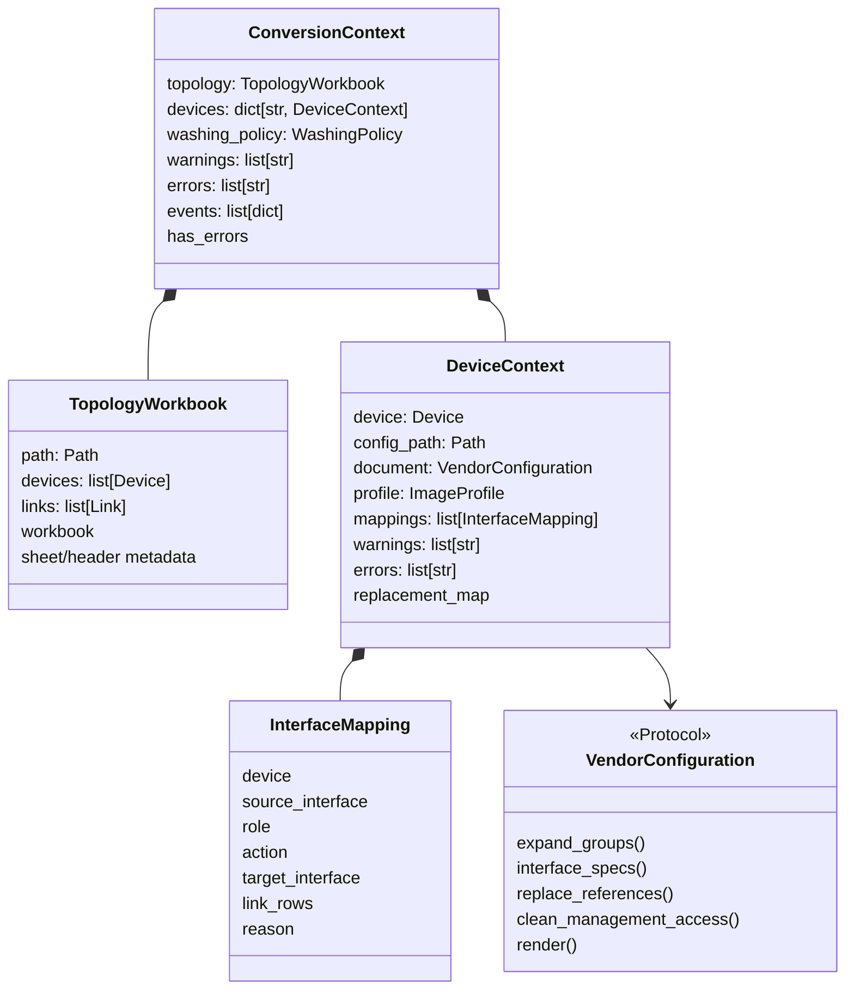
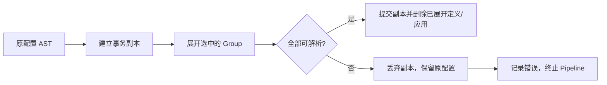
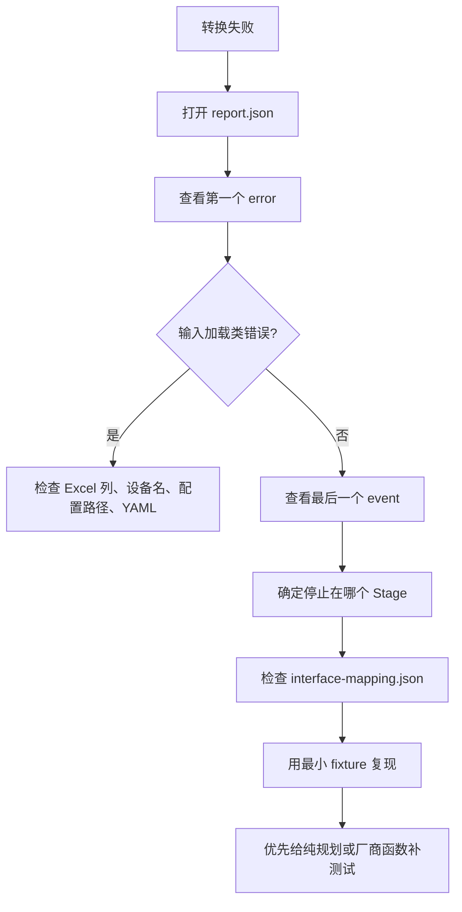
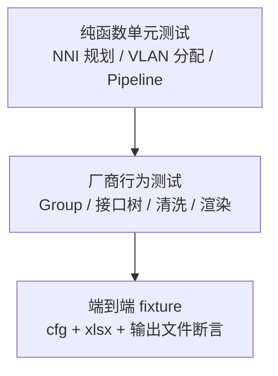

# 配置自适应项目新人导读

> 适用对象：第一次接触本项目、了解 Python 但不熟悉网络配置转换业务的开发者。
> 阅读目标：能够解释系统为什么存在、一次转换如何完成、代码职责如何划分，并能独立调试和完成常见扩展。

## 1. 先用一句话理解项目

本项目读取真实网络的 Excel 拓扑和 Cisco IOS XR / Juniper Junos 配置，把真实设备上的接口、聚合、非 NNI 清理、认证等配置转换成可在 GNS3 的 XRv9000 / vMX 镜像中运行的一套拓扑与配置。

它不是通用的“任意厂商配置翻译器”，核心目标是解决下面这个具体问题：

- 真实设备与虚拟镜像的接口名称、接口数量不同。
- 真实设备可能用多条物理链路组成聚合口，而实验环境希望压缩物理资源。
- 大量用户侧接口需要汇聚到有限的模拟器端口。
- 生产认证、AAA、SNMP 等管理面配置不能直接带进实验环境。
- 转换必须可审计、可重复，并且失败时不能产出看似可用、实际不完整的配置。

## 2. 建立业务心智模型

### 2.1 系统边界


```mermaid
flowchart LR
    Operator[网络工程师] -->|拓扑 Excel| Adaptor[配置自适应系统]
    Operator -->|IOS XR / Junos 配置| Adaptor
    Operator -->|镜像 Profile / Group 策略 / 清洗规则| Adaptor

    Adaptor -->|适配后的拓扑 Excel| GNS3[GNS3 实验环境]
    Adaptor -->|XRv9000 / vMX 配置| GNS3
    Adaptor -->|映射与转换报告| Audit[人工检查 / 自动化审计]

    Adaptor -.不转换，仅作为对端.-> Huawei[Huawei 设备]
```

当前支持：

- Cisco IOS XR 配置到 GNS3 XRv9000。
- Juniper Junos 大括号配置到 GNS3 vMX。
- Cisco 与 Juniper 之间的跨厂商 NNI。
- Cisco/Juniper 与 Huawei 相连的 NNI：只适配 Cisco/Juniper 端，Huawei 侧接口名不变。
- 普通链路、聚合链路和同一聚合跨多个对端的 M-LAG 形态。

当前不负责：

- Huawei 配置转换。
- Huawei 侧接口名与配置适配；Huawei 设备只作为拓扑对端。
- IOS、IOS XE、NX-OS 等其他 Cisco 操作系统的语法转换。
- 校验链路两端的 IP、VLAN、MTU、封装是否一致。
- 在 GNS3 中自动创建或启动节点。
- 保留非 NNI 接入业务或为其创建外部 GNS3 链路。

### 2.2 核心术语

| 术语 | 在本项目中的含义 | 如何识别 |
| --- | --- | --- |
| NNI | 网络设备之间的连接接口 | 以 Excel `链接表` 为权威来源 |
| 非 NNI | 不属于拓扑 NNI 聚合与子接口闭包的物理、聚合接口 | Group 展开后按原始链接表判定，连同业务依赖删除 |
| Loopback | 环回逻辑接口 | Cisco `Loopback*`，Junos `lo0.*`；原样保留 |
| 管理口 | 设备管理接口 | Cisco `MgmtEth*`，Junos `fxp*`、`em*` 等；不参与业务映射 |
| 聚合口 | 多个物理成员组成的逻辑接口 | Cisco `Bundle-Ether*`，Junos `ae*` |
| 聚合成员压缩 | 多条物理成员缩为一条，逻辑聚合及业务保持 | NNI 处理阶段完成 |
| Group | 厂商配置中的继承/模板机制 | Cisco `group/apply-group`，Junos `groups/apply-groups` |
| Profile | 目标虚拟镜像提供的接口和适配策略 | `config/image_profiles.yaml` |
| Mapping | 一条源接口到目标接口的可审计记录 | 输出到 `interface-mapping.json` |

### 2.3 最重要的分类规则

链接表决定 NNI。Group 展开后先计算端点、聚合、成员和子接口的保留闭包，再清理其余物理、聚合接口，最后迁移 NNI。


```mermaid
flowchart TD
    All[配置中的全部接口] --> Special{接口类型}
    Special -->|Loopback / 管理口 / 控制虚拟口 / 未知口| Preserve[保守保留]
    Special -->|物理或聚合| InTopology{属于原始 NNI 闭包?}
    InTopology -->|是| NNI[NNI 迁移]
    InTopology -->|否| Remove[删除接口与业务依赖]
    Special -->|BVI / IRB| Dependency{剩余 NNI 桥域仍依赖?}
    Dependency -->|是| Gateway[保留原网关类型]
    Dependency -->|否| Remove
```

Group 必须先展开，否则聚合关系可能不完整。清理必须在接口改名前完成，否则源口和目标口重名会干扰保留范围。被预检跳过的明确 NNI 仍保留身份，不能误删。

## 3. 输入和输出

### 3.1 必需输入

一次转换至少需要：

```text
input/
├── topology.xlsx
└── configs/
    ├── R1.cfg
    ├── R2.cfg
    ├── J1.cfg
    └── J2.cfg
```

Excel 至少包含两个工作表：

| 工作表 | 必需字段 | 含义 |
| --- | --- | --- |
| 设备列表 | 设备名称、厂商 | 定义设备主键和解析器类型 |
| 设备列表 | 配置文件（可选） | 未填写时按设备名查找 `.cfg/.conf/.txt` |
| 链接表 | A端设备、A端接口、Z端设备、Z端接口 | 定义物理 NNI |

程序兼容常见中英文 Sheet 名和列名，实际别名定义在 `adaptation/topology.py`。

设备名称是系统中的主键，必须非空且全局唯一。链接表只要某一列有值，就要求四个端点字段全部填写。

### 3.2 可选输入

| 文件 | CLI 参数 | 用途 |
| --- | --- | --- |
| 镜像 Profile | `--profiles` | 定义镜像、版本、可用接口和模拟参数策略 |

镜像接口列表有一个容易忽略的约定：

```text
interfaces[:-3]  = 按顺序分配给 NNI
interfaces[-3:]  = 三个空置预留口，不参与目标端口分配
```

例如默认 Cisco Profile 有 8 个接口，前 5 个可分配给 NNI，最后三个空置预留。

### 3.3 输出与失败语义

成功时：

```text
output/
├── topology-adapted.xlsx
├── configs/
│   └── <设备名>.cfg
├── interface-mapping.json
├── report.json
└── README.txt
```

失败时只写诊断文件：

```text
output/
├── interface-mapping.json
└── report.json
```

这是一个重要的安全边界：一旦存在错误，系统不会写出设备配置和适配后的拓扑，避免使用者误把“只转换了一半”的结果导入实验环境。

## 4. 一次完整转换发生了什么

### 4.1 总流程图


```mermaid
flowchart TD
    CLI[CLI: config-adaptor convert] --> Prepare[prepare_context]
    Prepare --> Excel[读取和校验 Excel]
    Prepare --> Profiles[加载镜像 Profile]
    Prepare --> Policy[加载 Group 策略]
    Prepare --> Parse[按厂商解析每台设备配置]

    Excel --> Context[ConversionContext]
    Profiles --> Context
    Policy --> Context
    Parse --> Context

    Context --> Preflight[1. 拓扑预检]
    Preflight --> Groups[2. Group 展开]
    Groups --> Preconfigured[3. 忽略预配置接口]
    Preconfigured --> Classify[4. 接口分类]
    Classify --> Cleanup[5. 非 NNI 清理]
    Cleanup --> NNI[6. NNI 规划与改写]
    NNI --> Rewrite[7. 全局引用更新]
    Rewrite --> Rules[8. 统一配置清洗规则]
    Rules --> Auth[9. 管理认证清洗]
    Auth --> Compatibility[10. 目标接口兼容]
    Compatibility --> Simulation[11. 模拟参数适配]
    Simulation --> Validation[12. 最终接口校验]
    Validation --> HasError{存在错误?}
    HasError -->|是| Diagnostics[只写 mapping + report]
    HasError -->|否| Outputs[写拓扑、配置、mapping、report、README]
```

### 4.2 调用时序图


```mermaid
sequenceDiagram
    actor User as 操作者
    participant CLI as adaptation/cli.py
    participant Entry as adaptation/service.py
    participant IO as topology / profiles / washing
    participant Parser as adaptation/factory.py
    participant Flow as ConversionPipeline
    participant Stage as adaptation 业务模块
    participant Doc as VendorConfiguration
    participant Output as write_outputs

    User->>CLI: config-adaptor convert ...
    CLI->>Entry: convert(...)
    Entry->>IO: 加载拓扑、Profile、策略
    loop 每台受支持设备
        Entry->>Parser: parse_document(vendor, text)
        Parser-->>Entry: CiscoDocument / JunosDocument
    end
    Entry->>Flow: execute(context)
    loop 按固定顺序执行 Stage
        Flow->>Stage: process(context)
        Stage->>Doc: 调用厂商无关业务能力
        Doc-->>Stage: 结果 / 配置变更
        Stage-->>Flow: 更新 context
        alt context.has_errors
            Flow-->>Entry: 立即停止后续 Stage
        end
    end
    Entry->>Output: write_outputs(context, output_dir)
    Output-->>CLI: ConversionContext
    CLI-->>User: 退出码 0 或 2
```

清洗规则已经是核心 Pipeline 的一个 Stage。前序 Stage 报错时不会继续清洗；`write_outputs()` 无论成功失败都会执行，以确保失败报告可用。

## 5. 代码架构

### 5.1 分层关系


```mermaid
flowchart TB
    subgraph Delivery[入口层]
        CLI[adaptation/cli.py]
    end

    subgraph Orchestration[编排层]
        Entry[adaptation/service.py]
        Stages[adaptation 业务模块]
        AppPipe[adaptation/pipeline.py]
    end

    subgraph Domain[领域模型与纯规划]
        Models[adaptation/models.py]
        NniPlan[adaptation/nni.py]
        Cleanup[adaptation/core_interfaces.py]
    end

    subgraph Port[厂商能力边界]
        API[common/contracts.py<br/>VendorConfiguration Protocol]
    end

    subgraph Cisco[Cisco 实现]
        CiscoParser[cisco/document.py]
        CiscoGroups[cisco/groups.py]
        CiscoInterfaces[cisco/interfaces.py]
        CiscoCleaning[cisco/cleaning.py]
        CiscoSimulation[cisco/simulation.py]
    end

    subgraph Juniper[Juniper 实现]
        JunosParser[juniper/document.py]
        JunosGroups[juniper/groups.py]
        JunosInterfaces[juniper/interfaces.py]
        JunosCleaning[juniper/cleaning.py]
        JunosSimulation[juniper/simulation.py]
    end

    subgraph IO[基础设施]
        Excel[adaptation/topology.py]
        Profiles[adaptation/profiles.py]
        Rules[adaptation/cleaning_rules.py]
    end

    CLI --> Entry
    Entry --> IO
    Entry --> AppPipe
    AppPipe --> Stages
    Stages --> Models
    Stages --> NniPlan
    Stages --> Cleanup
    Stages --> API
    CiscoParser -->|显式继承| API
    JunosParser -->|显式继承| API
    CiscoParser --> CiscoGroups
    CiscoParser --> CiscoInterfaces
    CiscoParser --> CiscoCleaning
    CiscoParser --> CiscoSimulation
    JunosParser --> JunosGroups
    JunosParser --> JunosInterfaces
    JunosParser --> JunosCleaning
    JunosParser --> JunosSimulation
```

`CiscoDocument` 和 `JunosDocument` 显式继承 `VendorConfiguration` Protocol，既保留结构化类型检查，也让 IDE 可以直接导航到具体实现。

### 5.2 各目录的职责

| 路径 | 职责 | 新人是否应先读 |
| --- | --- | --- |
| `adaptation/cli.py` | 参数解析、退出码 | 是 |
| `adaptation/service.py` | 准备上下文、执行流程、写输出 | 是 |
| `adaptation/topology.py`、`groups.py`、`interfaces.py`、`nni.py`、`core_interfaces.py`、`cleaning_rules.py`、`simulation.py` | 十二个业务阶段 | 是，核心 |
| `adaptation/models.py` | 设备、链路、映射、Profile、上下文 | 是 |
| `adaptation/pipeline.py` | Stage 协议和停止规则 | 是 |
| `adaptation/nni.py` | 聚合链路分组的纯计算 | NNI 业务时读 |
| `adaptation/core_interfaces.py` | NNI 保留闭包与依赖裁剪 | 修改实验保留范围时读 |
| `common/contracts.py` | 两家厂商显式实现、应用层依赖的能力协议 | 是，理解边界 |
| `cisco/document.py、juniper/document.py` | AST、解析、渲染及兼容 Facade | 第二阶段读 |
| `cisco/groups.py、juniper/groups.py` | 厂商 Group 事务式展开 | 专项阅读 |
| `cisco/interfaces.py、juniper/interfaces.py` | 业务接口分析和配置树修改 | 专项阅读 |
| `cisco/cleaning.py、juniper/cleaning.py` | 强制管理面清洗 | 专项阅读 |
| `cisco/simulation.py、juniper/simulation.py` | 镜像运行参数适配 | 专项阅读 |
| `adaptation/topology.py` | Excel 读写和列别名处理 | 输入问题时读 |
| `adaptation/profiles.py` | 镜像 Profile 加载与校验 | Profile 问题时读 |
| `adaptation/cleaning_rules.py` | 统一清洗规则加载与调度 | 修改清洗框架时读 |
| `cisco/rules/xrv9000/cleaning.yaml`、`juniper/rules/vmx/cleaning.yaml` | 各厂商的 PTP、接口类型约束及扩展清洗规则 | 增删清洗项时读 |

### 5.3 为什么有些东西是类，有些是函数

当前设计遵循“有持续状态或明确对象身份时使用类，无状态计算使用函数”：

- `ConversionPipeline` 是类：它持有固定顺序的 Stage 集合。
- `CiscoGroupExpander` / `JunosGroupExpander` 是类：递归展开期间需要维护事务副本、继承栈、优先级和冲突状态。
- `CiscoDocument` / `JunosDocument` 是类：它们持有并修改一份配置 AST。
- `ConversionContext` 等是 dataclass：它们表达一次转换过程中的领域数据。
- `plan_nni_components()` 是函数：输入链路和聚合关系，输出不可变计划，不持有状态。
- `plan_nni_components()` 是函数：输入链路和聚合关系，稳定地产生组件计划。
- `cisco/interfaces.py、juniper/interfaces.py`、`cleaning.py`、`simulation.py` 使用模块函数：这些操作依赖传入的 Document，但自身不需要额外对象生命周期。

## 6. 贯穿流程的核心数据

### 6.1 数据关系图


```mermaid
classDiagram
    class ConversionContext {
        topology: TopologyWorkbook
        devices: dict[str, DeviceContext]
        washing_policy: WashingPolicy
        warnings: list[str]
        errors: list[str]
        events: list[dict]
        has_errors
    }

    class TopologyWorkbook {
        path: Path
        devices: list[Device]
        links: list[Link]
        workbook
        sheet/header metadata
    }

    class DeviceContext {
        device: Device
        config_path: Path
        document: VendorConfiguration
        profile: ImageProfile
        mappings: list[InterfaceMapping]
        warnings: list[str]
        errors: list[str]
        replacement_map
    }

    class InterfaceMapping {
        device
        source_interface
        role
        action
        target_interface
        link_rows
        reason
    }

    class VendorConfiguration {
        <<Protocol>>
        expand_groups()
        interface_specs()
        replace_references()
        clean_management_access()
        render()
    }

    ConversionContext *-- TopologyWorkbook
    ConversionContext *-- DeviceContext
    DeviceContext *-- InterfaceMapping
    DeviceContext --> VendorConfiguration
```

### 6.2 `ConversionContext` 是流程总账

每个 Stage 接收同一个 `ConversionContext`，主要修改四类内容：

1. `topology.links`：目标接口名、链路是否有效、被删除原因。
2. `device.document`：设备配置 AST。
3. `device.mappings`：每一次接口迁移、删除、逻辑保留或跳过。
4. `errors/warnings/events`：面向用户和审计系统的诊断信息。

不要在 Stage 之间增加隐藏的全局变量。需要跨阶段传递的数据，应进入 Context、DeviceContext 或一个明确的计划对象。

### 6.3 `InterfaceMapping` 不只是改名字典

映射区分逻辑保留与物理成员：

```json
[
  {"source_interface":"Bundle-Ether10","role":"NNI","action":"preserve","target_interface":"Bundle-Ether10"},
  {"source_interface":"HundredGigE0/0/0/0","role":"NNI","action":"map-member","target_interface":"GigabitEthernet0/0/0/0"}
]
```

逻辑自映射不会生成 Bundle 到物理口的字符串替换。普通物理口和子接口仍按目标口重写引用。

## 7. 十二个核心 Stage

| 顺序 | Stage | 主要职责 |
| --- | --- | --- |
| 1 | `CleaningRulesHandler(pre_analysis)` | 清理完整 banner |
| 2 | `TopologyPreflightHandler` | 校验链路端点、保留跳过端点的 NNI 身份 |
| 3 | `GroupExpansionHandler` | 事务式展开并校验 Group |
| 4 | `PreconfiguredInterfaceCleanupHandler` | 忽略未实例化候选接口 |
| 5 | `InterfaceClassificationHandler` | 按厂商白名单分类 |
| 6 | `NonNNICleanupHandler` | 计算原始 NNI 闭包，删除非 NNI 与业务依赖 |
| 7 | `NNIHandler` | 分组、成员压缩、聚合保留、端口分配 |
| 8 | `ReferenceRewriteHandler` | 更新保留 NNI 的全局引用 |
| 9 | `CleaningRulesHandler(post_rewrite)` | 路径清洗与认证替换 |
| 10 | `InterfaceCompatibilityHandler` | 按目标接口上下文处理已知限制 |
| 11 | `SimulationAdaptationHandler` | 目标口启用、硬件参数清理和 BFD 稳定性调整 |
| 12 | `FinalInterfaceValidationHandler` | 检查最终接口状态和已知非法残留 |

任一阶段写入错误后，`ConversionPipeline` 停止后续阶段，不输出设备配置。目标兼容和最终校验不受模拟参数 `off` 模式影响。

## 8. Group 展开

### 8.1 为什么 Group 很早处理

下面这类信息都可能只存在于 Group 中：

- 接口地址和 VLAN。
- Bundle/ae 成员关系。
- 协议中的接口引用。
- 用户、AAA 和管理服务。
- 扩展清洗所关注的配置。

如果不先展开，后续接口分类与清洗看到的是不完整配置。

### 8.2 统一全量处理

系统展开并校验所有活动的 Group 引用及其完整依赖，不再提供按相关性筛选或
原样保留模式。未被活动配置引用的模板不会参与求值；活动引用存在缺失、循环、
运行时变量或其他无法安全静态解释的语义时，本次转换整体回滚。
Junos 的 `inactive:` 节点及其完整子树不参与 group 求值；父节点保留时，输出仍保留 `inactive:` 前缀和子树。若父节点因 group 展开或接口迁移被删除，其 inactive 子节点随之删除。
这对应 Junos 普通配置中保留停用语句、继承后生效视图中排除停用语句的区别；参见 [Juniper 的停用配置说明](https://www.juniper.net/documentation/us/en/software/junos/cli/topics/topic-map/modifying-configuration.html) 和 [继承后配置说明](https://www.juniper.net/documentation/us/en/software/junos/automation-scripting/topics/concept/junos-script-automation-commit-script-works.html)。
多个顶层 `groups {}` 会先规范化成一个容器，同名 Group 的配置片段按出现顺序合并。

### 8.3 统一优先级

两个厂商都遵守：

```text
显式配置
  > 更内层应用的 Group
  > 更外层应用的 Group
  > 同一 Group 列表中更靠前的 Group
```

冲突不是按“命令第一个单词”粗略判断，而是按完整层级和语义键判断。例如 `ipv4 address` 与 `ipv4 access-group` 不是同一个键；多个可重复的地址也不能互相覆盖。

### 8.4 事务语义


```mermaid
flowchart LR
    Original[原配置 AST] --> Copy[建立事务副本]
    Copy --> Expand[展开选中的 Group]
    Expand --> Valid{全部可解析?}
    Valid -->|是| Commit[提交副本并删除已展开定义/应用]
    Valid -->|否| Rollback[丢弃副本，保留原配置]
    Rollback --> Error[记录错误，终止 Pipeline]
```

Cisco 和 Junos 的语法、通配符和递归机制不同，因此 Group 算法分别位于两个厂商目录，而事务和优先级原则保持一致。

## 9. NNI：物理成员映射与聚合保留

Excel 只列物理链路。Group 展开后从成员绑定反查 Bundle/ae，再纳入其全部子接口和必要业务依赖。聚合逻辑接口无需出现在 Excel。

同一对端经两端确认的聚合多链路缩减为最早一条，物理成员按 Profile 映射；逻辑聚合名、子接口、IP/VRF/封装和协议引用保持。成员使用 `bundle id` 或 `802.3ad` 重新关联原聚合，单成员门限定向调整。后续清洗和模拟适配必须保留绑定与原协商方式。

跨对端同聚合默认失败，不猜测 MC-LAG 或复制逻辑业务。两端聚合/协商不一致、源成员混有独立业务、孤立有业务聚合无法确认归属时，均在迁移前报错。已跳过端点仍受保护，最后三个口继续预留。

物理改名使用占位口避开源目标重名；业务主口始终保持 Bundle/ae 类型。

## 10. 非 NNI 清理：保留闭包与依赖裁剪

实验只展示并适配链接表中的 NNI。其他物理、聚合口及子接口即使有地址或 L2 业务，也不再迁移到共享子接口，不生成运输 VLAN 或 QinQ。

保留范围由原始拓扑端点、聚合成员关系及逻辑父口/子接口共同决定。删除非 NNI 时，协议接口、VRF、L2VPN、bridge-domain、VLAN 和 routing-instance 中的引用同时删除。完全失去接入口的业务容器删除，混合容器保留其余 NNI 成员。BVI/IRB 只有仍被 NNI 桥域或 VLAN 依赖时才保持原网关类型。

每条接口删除使用 `role=NON_NNI`、`action=remove`、空目标接口写入 mapping/report。NNI 分配仍只使用前 n-3 个数据口；最后三个接口全部空置预留。

## 11. 厂商实现如何隔离

### 11.1 应用层只依赖业务能力

`adaptation` 的业务处理模块不应该知道 `CiscoNode` 或 `JunosNode`。它们只通过 `VendorConfiguration` 调用：

- `expand_groups()`
- `interface_specs()` / `business_interface_names()`
- `clone_interface_tree()` / `rename_interface_tree()`
- `prune_non_nni()` / `adapt_interfaces()` / `validate_interfaces()`
- `replace_references()`
- `clean_management_access()`
- `adapt_to_simulation()`
- `render()`

这使相同的 NNI 与非 NNI 清理流程可以同时调度 Cisco 与 Juniper，而厂商语法差异留在各自实现中。

### 11.2 Cisco 文档模型

IOS XR 配置由缩进和 `!` 边界构成树：

```text
interface GigabitEthernet0/0/0/0
 description TO-R2
 ipv4 address 10.0.0.1 255.255.255.252
!
```

主要对象是 `CiscoNode`。`CiscoDocument.root` 是不参与渲染的虚拟根，顶层命令和任意深度的子命令都使用同一节点类型。`CiscoDocument` 负责解析、保存节点顺序、提供 Facade 方法和最终渲染；接口、Group、清洗、模拟适配的具体算法放在 `cisco/`。

### 11.3 Junos 文档模型

Junos 配置天然是大括号树：

```text
interfaces {
    ge-0/0/0 {
        unit 0 {
            family inet {
                address 10.0.0.1/30;
            }
        }
    }
}
```

主要对象是 `JunosNode`。`JunosDocument` 管理整棵树并提供相同的 Facade 能力，具体算法位于 `juniper/`。

### 11.4 新增厂商时应遵循的边界

新增厂商通常需要：

1. 在 `Vendor` 中增加厂商枚举及别名。
2. 增加配置 Document、AST、解析和渲染。
3. 实现 `VendorConfiguration` 的全部能力。
4. 增加 Profile 默认值及 YAML 支持。
5. 在 `parse_document()` 中注册解析器。
6. 增加独立 fixture 与端到端测试。

不要在 `NNIHandler` 或 `NonNNICleanupHandler` 中加入大量 `if vendor == ...`。如果差异属于语法或配置树操作，应下沉到厂商模块；只有真正跨厂商的业务策略才留在应用层。

## 12. 清洗与模拟适配

### 12.1 强制管理面清洗

系统始终删除生产环境中的：

- 本地账号。
- AAA、TACACS+、RADIUS。
- SSH/Telnet 网络管理服务与 SSH 信任。
- SNMP。
- 厂商相关的用户组、权限组和旧认证引用。

随后为 IOS XR 写入 `root` 账号，为 Junos 只配置 root 认证。密码均为 `admin123`，只应用于隔离的 GNS3 实验环境；报告不得回显被删除的秘密值。

### 12.2 统一清洗规则

清洗规则分为两类：简单规则按厂商位于目标镜像目录的 `cleaning.yaml`，复杂规则实现 `ExecutableCleaningRule` 并在 `cleaning_rules.py` 的内置注册表中注册。两类规则由同一 Handler 执行，不通过 CLI 接收外部规则。YAML 规则通过 `enable` 控制并固定在 `post_rewrite`；代码规则声明 `pre_analysis` 或 `post_rewrite`。所有命中均通过 `category` 汇总报告。

YAML 规则的本地 `id` 使用点号划分命名层级，每一段可由小写字母、数字、下划线和中划线组成；加载后系统自动添加 `cisco.` 或 `juniper.` 前缀。

规则在接口迁移和引用改写之后运行，支持：

| 动作 | 语义 |
| --- | --- |
| `delete` | 删除匹配配置 |
| `replace` | 替换匹配值 |

YAML 规则固定先删除、后替换，最多两轮 AST 遍历。每个节点只采用该轮首条匹配的规则；删除时跳过后代，替换后不再对该节点级联匹配，但子节点会使用更新后的父级路径。审计事件按删除组、替换组顺序输出，认证代码规则最后独立执行。`mask`、`warn` 不再是清洗动作；这不影响 group 语义冲突的告警策略。

把规则放到核心接口分类之后，是为了防止清洗意外删除分类依据，改变 NNI 保留闭包的核心语义。默认保留未知配置仍是项目的保守原则。

### 12.3 模拟参数模式

| 模式 | 行为 |
| --- | --- |
| `off` | 不做模拟参数适配 |
| `compatible` | 启用已映射数据口，删除目标口不适用于镜像的物理硬件参数 |
| `stable` | 在 `compatible` 基础上，提高配置中已经存在且过低的 BFD 参数 |

系统不会凭空开启 BFD，也不会默认改写 OSPF、IS-IS 或 BGP 的业务定时器；只处理本次映射涉及的数据口。

## 13. 报告、告警与错误

### 13.1 三种诊断层次

| 类型 | 含义 | 是否阻断 |
| --- | --- | --- |
| `event` | 正常转换事实，如成员压缩、Group 冲突、认证清洗 | 否 |
| `warning` | 保守保留或跳过，结果仍可用 | 否 |
| `error` | 无法保证结果完整正确 | 是 |

典型 Warning：

- 未识别的接口类型被原样保留，不参与物理映射。
- Huawei 设备不参与配置转换，只作为拓扑对端保留。

典型 Error：

- Excel 缺少必需 Sheet 或列。
- 链路端点设备不存在。
- 非物理/聚合接口被用作 NNI 端点。
- NNI 目标物理接口不足。
- 聚合成员关系存在歧义。
- Group 无法安全展开。
- 已知目标接口冲突无法转换或最终校验失败。
- 配置语法无法安全解析。

### 13.2 `report.json` 阅读顺序

建议按以下顺序排查：

1. `status`：确认整体成功或失败。
2. `errors`：找第一个业务阻断原因。
3. `warnings`：确认有哪些内容被保留或跳过。
4. `summary`：核对设备、链路、映射和适配数量。
5. `events`：还原处理细节。
6. `group_conflicts`：专项检查继承覆盖。

`events` 是按处理时间追加的，因此也可以视为一次轻量级审计时间线。

## 14. 如何运行项目

### 14.1 环境

- Python 3.11 或更高版本。
- 运行依赖只有 `openpyxl` 和 `PyYAML`。

推荐安装开发版本：

```bash
python3 -m pip install -e .
```

### 14.2 执行转换

```bash
config-adaptor convert \
  --topology topology.xlsx \
  --config-dir configs \
  --output-dir output \
  --profiles config/image_profiles.yaml
```

也可不安装直接执行：

```bash
PYTHONPATH=src python3 -m config_adaptor convert \
  --topology topology.xlsx \
  --config-dir configs \
  --output-dir output
```

退出码：

- `0`：成功。
- `2`：参数、加载、转换或输出失败。

### 14.3 运行测试

```bash
PYTHONPATH=src python3 -m unittest discover -s tests -v
```

测试分为两类：

- `tests/test_architecture.py`：纯规划器、Pipeline 停止行为、厂商协议边界。
- `tests/test_conversion.py`：真实 cfg/xlsx fixture 驱动的端到端业务场景。

## 15. 新人调试指南

### 15.1 从一次失败开始定位


```mermaid
flowchart TD
    Failed[转换失败] --> Report[打开 report.json]
    Report --> FirstError[查看第一个 error]
    FirstError --> Input{输入加载类错误?}
    Input -->|是| ExcelConfig[检查 Excel 列、设备名、配置路径、YAML]
    Input -->|否| Event[查看最后一个 event]
    Event --> Stage[确定停止在哪个 Stage]
    Stage --> Mapping[检查 interface-mapping.json]
    Mapping --> Fixture[用最小 fixture 复现]
    Fixture --> Unit[优先给纯规划或厂商函数补测试]
```

### 15.2 常见现象与入口

| 现象 | 优先查看 |
| --- | --- |
| 找不到 Sheet/列 | `adaptation/topology.py` |
| 配置文件找不到或路径被拒绝 | `adaptation/service._safe_config_path()` |
| Group 继承结果不对 | `<厂商>/groups.py` 和 `group_conflicts` |
| 接口被当成未知类型 | 对应解析器的 `interface_kind` |
| 聚合链路被错误合并 | `adaptation/nni.py` |
| M-LAG 少了一个目标 | `NNIHandler` 的 `plans_by_logical` 和 mappings |
| 非 NNI 删除范围异常 | 原始拓扑、聚合闭包与 `NON_NNI` mapping |
| 目标接口导入失败 | 接口兼容/最终校验事件与真实设备诊断 |
| 协议仍引用旧接口 | `replacement_map` 和 `replace_references()` |
| 某配置被意外删除 | mandatory/optional cleaning 事件与外部 rule 事件 |
| BFD 值发生变化 | Profile 的 `simulation_adaptation` 与对应事件 |

### 15.3 推荐的调试观察点

一次接口问题通常按下面的状态变化排查：

```text
原始配置接口名
  → resolve_interface() 后的规范名
  → interface_specs() 中的 kind/parent/unit/vlan
  → NNI component plan 或非 NNI 保留闭包
  → InterfaceMapping
  → replacement_map
  → render() 后的最终配置
```

不要只比较最终文本。Mapping 和 Event 能更快说明“系统为什么做出这个决定”。

## 16. 常见开发任务应该改哪里

### 16.1 增加一种接口名缩写

1. 修改对应解析器的 canonical 函数。
2. 增加解析器级测试或端到端 fixture。
3. 验证 Excel 缩写和配置完整名能解析到同一个父接口。

### 16.2 增加一种业务接口识别依据

1. 修改 `<厂商>/interfaces.py` 的业务闭包分析。
2. 确认它是否会激活 BVI/IRB 网关。
3. 同时添加“NNI 仍依赖网关”和“仅非 NNI 依赖网关”的测试，避免误删或误保留。

### 16.3 增加目标接口兼容规则

1. 明确目标镜像和接口上下文，区分物理父口、L3 子接口与 L2 子接口。
2. 对已知限制选择安全删除、调整位置或阻断转换，并记录原因。
3. 添加转换前后测试和最终校验反例，保留无关路由协议配置。
4. 使用实际镜像版本补做 load/commit 验收；静态规则没有覆盖的命令不能宣称已验证。

### 16.4 增加一个 Pipeline 阶段

1. 判断它应位于接口改写前还是后。
2. 实现只带 `process(context)` 的 Stage。
3. 在 `build_default_pipeline()` 中显式插入。
4. 测试阶段顺序和出错停止行为。
5. 如果存在厂商差异，把语法操作加入 `VendorConfiguration`，实现放到厂商模块。

### 16.5 增加清洗项

- 所有环境都必须清理的管理面内容：修改厂商 `clean_management_access()`。
- PTP、协议认证、PKI、硬件、NAT、流量统计及镜像版本相关内容：在对应厂商目标镜像目录的 `cleaning.yaml` 增加规则。
- 规则默认 `enable: true`；需要保留某类配置时由项目维护者在内置文件中关闭，同一 `category` 的规则应同时开关。
- 只有“删除旧认证并配置实验登录凭据”这类复合业务动作继续保留专用 Handler。

## 17. 测试策略

### 17.1 测试金字塔


```mermaid
flowchart TB
    E2E[端到端 fixture<br/>cfg + xlsx + 输出文件断言]
    Vendor[厂商行为测试<br/>Group / 接口树 / 清洗 / 渲染]
    Pure[纯函数单元测试<br/>NNI 规划 / VLAN 分配 / Pipeline]

    Pure --> Vendor --> E2E
```

优先把跨厂商的业务计算写成纯函数，快速覆盖边界；厂商 AST 修改用厂商测试；最后用端到端测试保证所有环节能组合工作。

### 17.2 Fixture 命名所代表的业务

| 目录 | 主要覆盖 |
| --- | --- |
| `iosxr_bundle` | Cisco 聚合 NNI、非 NNI 清理、认证清洗 |
| `junos_bundle` | Junos 聚合 NNI、非 NNI 清理、认证清洗 |
| `iosxr_duplicate_vlan` | 重复 VLAN 的非 NNI 裁剪 |
| `iosxr_mlag` | Cisco 聚合跨对端拆分、非 NNI 裁剪、一对多引用 |
| `junos_mlag` | Junos ae 跨对端拆分、非 NNI 与网关清理 |
| `cross_vendor` | Cisco/Juniper 普通及聚合互联 |
| `huawei_peer` | Huawei 只作为对端，Cisco/Juniper 端仍完成 NNI 适配 |
| `junos_unresolved` | Group 无法解析时回滚和失败输出 |
| `group_configs` | Group 优先级、通配、循环和冲突 |
| `washing_configs` | 强制与扩展清洗 |
| `simulation_adaptation` | 镜像适配范围和幂等性 |

### 17.3 修改代码后的最低检查

```bash
PYTHONPATH=src python3 -m compileall -q src tests
PYTHONPATH=src python3 -m unittest discover -s tests -v
git diff --check
```

涉及输出语法时，还应人工检查至少一个对应厂商的最终 cfg、`interface-mapping.json` 和 `report.json`。

## 18. 设计原则与代码评审检查表

### 18.1 高内聚、低耦合在本项目中的具体含义

- 业务阶段关心“做什么”，厂商模块关心“用什么语法做”。
- AST 类型不泄漏到 `adaptation` 的业务处理模块。
- NNI 分组和 VLAN 分配不依赖 Cisco/Junos 文本结构。
- 一个 Stage 只处理一个明确的业务阶段。
- 所有可审计副作用都进入 mapping、event、warning 或 error。
- 新厂商通过实现能力协议扩展，不修改每一个现有业务阶段。

### 18.2 避免过度拆分

新增文件或类之前先问：

1. 它是否有独立业务概念或变化原因？
2. 它是否能形成清晰、稳定的输入输出边界？
3. 它是否需要持有跨多个操作的状态？
4. 拆出后是否能独立测试或复用？

如果答案都是否，优先保留为现有模块中的私有函数。不要为单个无状态动作创建 `SomethingService`。

### 18.3 评审一个转换改动

- 是否保持相同输入产生相同输出？
- 是否在修改 AST 之前完成必要校验和规划？
- 是否考虑普通接口、子接口、聚合和 M-LAG？
- 是否同时更新非接口定义中的引用？
- 是否记录 mapping/event？
- 是否会在报告中泄露密码或密钥？
- 失败时是否会停止后续阶段并阻止配置输出？
- Cisco 与 Juniper 的差异是否放在厂商边界内？
- 是否有正向、冲突和失败测试？

## 19. 推荐阅读顺序

如果只有 30 分钟：

1. 本文第 1～4 节，建立业务和总流程。
2. `adaptation/models.py`，认识 Context、Link、Mapping 和 Profile。
3. `adaptation/service.py` 的 `convert()`。
4. `adaptation/pipeline.py` 的 `build_default_pipeline()` 和十二个 Stage 类名。
5. 选一个 `tests/test_conversion.py` 的端到端用例，从输入断言看到输出。

如果有半天：

1. 按上面的 30 分钟路径阅读。
2. 详细阅读 `NNIHandler`、`NonNNICleanupHandler`。
3. 阅读 NNI、非 NNI 清理及接口兼容模块。
4. 只选择自己更熟悉的一个厂商，阅读其 parser 和 `<厂商>/interfaces.py`。
5. 本地运行一个 fixture，并对照输出 mapping/report。

如果准备开始开发：

1. 阅读 `common/contracts.py`，明确跨厂商能力边界。
2. 阅读相关业务 fixture 和已有断言。
3. 阅读目标厂商的 Group、接口、清洗或模拟适配模块。
4. 先补失败测试，再做最小实现。
5. 跑全量测试，并人工审查最终配置与报告。

## 20. 一条建议的代码跟踪路线

以命令行转换为例，从以下符号依次跳转，能够完整走通主干：

```text
config_adaptor.adaptation.cli.main
  → config_adaptor.adaptation.service.convert
  → config_adaptor.adaptation.service.prepare_context
  → config_adaptor.adaptation.topology.load_topology
  → config_adaptor.adaptation.factory.parse_document
  → config_adaptor.adaptation.pipeline.build_default_pipeline
  → ConversionPipeline.execute
  → 各 Handler.process
  → CleaningRulesHandler / VendorConfiguration 的厂商实现
  → config_adaptor.adaptation.service.write_outputs
```

在 IDE 中建议先沿这条主干走一遍，再深入 Group 或 AST。直接从 500 行左右的厂商算法开始读，容易知道“怎么实现”，却不知道“为什么此时调用”。

## 21. 常见问题

### 为什么不直接做字符串替换？

因为配置具有层级，物理成员映射与逻辑聚合保留必须分开，Group 还存在继承优先级。简单字符串替换会破坏接口类型及成员绑定。

### 为什么不先把所有配置统一成一个巨大通用 AST？

Cisco 块结构和 Junos 树结构差异很大。当前设计只统一应用层真正需要的能力和 `InterfaceSpec` 等小型数据结构，避免为了表面统一而丢失厂商语义。

### 为什么未知接口保留，而不是删除？

删除未知配置的风险高于保留。只要它没有被当作 NNI 物理端点，系统会告警并原样保留；若它被用作必须映射的 NNI，则因为无法保证正确性而失败。

### 为什么清洗规则在接口转换之后？

核心分类需要完整的原始业务依据。先运行清洗删除规则，可能让一个有效接口失去 IP、VLAN 或引用，从而改变 NNI 保留闭包决策。

### 为什么失败还会创建输出目录？

为了写出 `report.json` 和已有的 `interface-mapping.json`，帮助定位失败；设备配置和适配拓扑不会生成。

### 为什么认证替换是强制的？

生产账号、AAA 和网络管理服务既可能在实验镜像中不可用，也涉及秘密信息和安全风险。项目为 IOS XR 配置实验账号、为 Junos 配置 root 认证，并确保报告不回显原秘密。

## 22. 相关文档

- `README.md`：安装、运行、输入输出和能力概览。
- `docs/requirements.md`：需求与验收基线。
- `docs/processing-flow.md`：Cisco/Junos 配置改写的详细规则。
- `config/image_profiles.yaml`：镜像 Profile 示例。
- `src/config_adaptor/cisco/rules/xrv9000/cleaning.yaml`：XRv9000 配置清洗规则。
- `src/config_adaptor/juniper/rules/vmx/cleaning.yaml`：vMX 配置清洗规则。

建议把本文作为第一入口，把 `requirements.md` 当作“系统必须满足什么”，把 `processing-flow.md` 当作“具体语法如何改写”。

## 23. 自动测试与实际设备验收

本地测试覆盖 AST、转换、依赖裁剪、接口规则和模拟 Console 交互。当前未连接真实 XRv9000，自动测试通过不代表已验证目标镜像 CLI 支持。实际验收必须记录镜像版本并确认配置 load/commit 成功、NNI 父口/子接口状态和所需路由邻接；设备失败回显应脱敏后转成回归样例。
